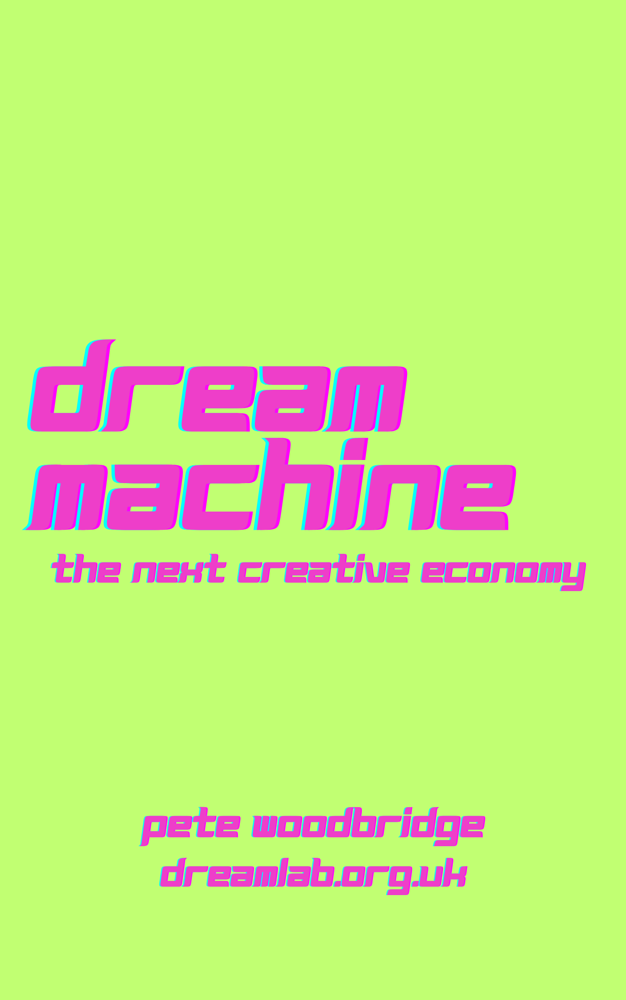

# Dream Machine

### *The New Creative Economy*

A practitioner's account of the year generative AI re-platformed the creative industries — written from inside the work, week by week, between October 2025 and May 2026.

<p align="center">
  <a href="Book/build/Dream_Machine_2026-05-21.pdf">
    
  </a>
</p>

<p align="center">
  <strong><a href="Book/build/Dream_Machine_2026-05-21.pdf">📖 Read the latest PDF (21 May 2026) →</a></strong>
</p>

### Editions

Each rebuild of the book ships as its own dated PDF, so earlier editions stay readable alongside the current one. The newest edition is always at the top.

| Edition | Newsletter span | PDF |
|---|---|---|
| **21 May 2026** *(current)* | Issues 1–30 | [Dream_Machine_2026-05-21.pdf](Book/build/Dream_Machine_2026-05-21.pdf) |
| 14 May 2026 | Issues 1–29 | [Dream_Machine_2026-05-14.pdf](Book/build/Dream_Machine_2026-05-14.pdf) |

---

## A living book

This is not a static manuscript. *Dream Machine* is a **living book**, rebuilt weekly from the [*Dream Machine* newsletter](https://www.linkedin.com/newsletters/dream-machine-creative-ai-7379776527871381505/) and its evolving research archive. Each week a new newsletter issue ships, the corresponding chapters are updated, footnotes are added, predictions are checked against the moment, and the PDF is re-rendered.

If you've read it once, the version you read next month will be different — sometimes by paragraphs, occasionally by chapters. The book is a snapshot of a transition in motion. That is, in part, the point.

## Where the book comes from

- **[Dream Machine newsletter](https://www.linkedin.com/newsletters/dream-machine-creative-ai-7379776527871381505/)** — the weekly LinkedIn newsletter that the book is built out of. New edition every week.
- **[Dream Machine podcast](https://open.spotify.com/show/2ptbLwVWeyO7ooPGHoYTqk?si=0566baf9826242c0)** — long-form conversations on the same material.
- **[DreamLab AI Collective](https://dreamlab.org.uk/)** — the studio in the North West of England where the work is done.

Written by [Pete Woodbridge](https://dreamlab.org.uk/) — creative technologist, founder of DreamLab AI Collective.

## What's in it

Eighteen chapters and eight deep-dive appendices, ~160,000 words, covering:

- The Tilly Norwood week and the launch of Sora 2
- The Human–AI Agency Continuum (a practitioner's framework)
- The Dead Internet / Living Web split
- The Slop Ceiling and the Authenticity Premium
- The UK's 88% copyright consultation and the Petrillo-template levy mechanism
- Four strategic positions the studios are choosing between
- World models replacing flat video as the default medium
- The Orchestrator role and the AI Literacy Premium
- The Age of the *Why* — the chess-grandmaster strategy applied to creative work
- A five-year speculative future-cast (Chapter 17)
- A complete inventory of every significant tool, platform and model from the period

See the full table of contents in the [Foreword](Book/00_Foreword.md).

## Repo layout

```
Book/
├── 00_Foreword.md ... 18_Epilogue.md     # The chapters
├── A1_…md ... A8_…md                     # The deep-dive appendices
├── assets/
│   ├── cover.png, back_cover.png         # Cover art
│   └── book.css                          # Book typography
├── build/
│   └── Dream_Machine_YYYY-MM-DD.pdf      # Dated edition (one per rebuild)
├── build_book.py                         # The build pipeline
└── watch_book.py                         # Auto-rebuild on file change

Dream Machine MD/                         # Newsletter issue archives
Dream Machine PDFs/                       # Newsletter PDF archives
Deep Dive MD/                             # Deep-dive research source material
Research/                                 # Underlying research notes
```

## Building the book

Requirements: Python 3.11+, [Pandoc](https://pandoc.org/), and Microsoft Edge (Windows). One-time setup:

```
pip install pymupdf
```

Build the PDF:

```
python Book/build_book.py
```

The build is a two-pass pipeline — Pandoc converts the chapter markdown to HTML, headless Edge renders that HTML to PDF, drop-cap positions are scanned to discover chapter page numbers, and the table of contents is re-rendered with those numbers before a final merge with the standalone cover PDFs.

Each build writes to `Book/build/Dream_Machine_<EDITION_SLUG>.pdf` where `EDITION_SLUG` is set near the top of [`build_book.py`](Book/build_book.py). To cut a new dated edition, bump `DATE` and `EDITION_SLUG` together and re-run — prior editions are left untouched on disk so older readings stay reachable.

Auto-rebuild while editing:

```
python Book/watch_book.py
```

## Reading the book without building it

If you don't want to run the toolchain, every dated edition is committed in [Book/build/](Book/build/) — open the most recent one (currently [Dream_Machine_2026-05-21.pdf](Book/build/Dream_Machine_2026-05-21.pdf)) or any prior edition from the table above.

## The companion website

The repo also ships a static website — **Dream Machine: A creative's guide to AI** — that turns the book's tool inventory and newsletter archive into a browsable, searchable toolkit. It lives in [site/](site/) and is regenerated automatically every time the book is rebuilt.

Preview it locally:

```
python site/serve.py     # opens http://localhost:8765/site/
```

Rebuild only the site (without rebuilding the book PDF):

```
python site/build_site.py
```

The site mirrors the book's content into four entry points: **Toolkit** (the 550+ tool inventory from Chapter 16, with live search and faceted filtering), **Use Cases** (the Reader Paths persona stacks), **Issues &amp; Challenges** (the structural debates anchored to chapters) and a **Newsletter archive** of every issue.

## Get in touch

The newsletter has only ever been as good as the community of creatives, technologists, union reps, academics, festival programmers, indie filmmakers, working musicians and audience members who have, week after week, sent in the things the editor would otherwise have missed. If you've got something we need to know about for the next edition, reach out via the [newsletter](https://www.linkedin.com/newsletters/dream-machine-creative-ai-7379776527871381505/) or [DreamLab](https://dreamlab.org.uk/).

---

## License

Dual-licensed at your option under either of:

- **MIT License** ([LICENSE-MIT](LICENSE-MIT) or [opensource.org/licenses/MIT](https://opensource.org/licenses/MIT))
- **Apache License, Version 2.0** ([LICENSE-APACHE](LICENSE-APACHE) or [apache.org/licenses/LICENSE-2.0](https://www.apache.org/licenses/LICENSE-2.0))

Unless you explicitly state otherwise, any contribution intentionally submitted for inclusion in this work by you, as defined in the Apache-2.0 license, shall be dual-licensed as above, without any additional terms or conditions.

© 2026 Pete Woodbridge / DreamLab AI Collective.
