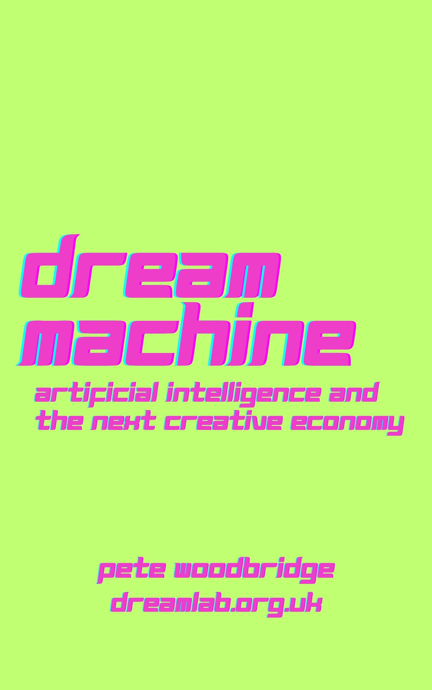

# Dream Machine

### *Artificial Intelligence and the Next Creative Economy*

A practitioner's account of the year generative AI re-platformed the creative industries — written from inside the work, week by week, between October 2025 and June 2026.

<p align="center">
  <a href="Book/build/Dream_Machine.pdf">
    
  </a>
</p>

<p align="center">
  <strong><a href="Book/build/Dream_Machine.pdf">📖 Read the latest PDF →</a></strong>
  &nbsp;&nbsp;·&nbsp;&nbsp;
  <strong><a href="https://www.amazon.com/dp/B0H44ZSGP2">🛒 Buy in print on Amazon →</a></strong>
  &nbsp;&nbsp;·&nbsp;&nbsp;
  <strong><a href="https://petejwoodbridge.github.io/DreamMachine-Book/">🌐 Browse the companion site →</a></strong>
</p>

### Editions

Each rebuild of the book ships as its own dated PDF, so earlier editions stay readable alongside the current one. The newest edition is always at the top.

| Edition | Newsletter span | PDF |
|---|---|---|
| **4 June 2026** *(current)* | Issues 1–32 | [Dream_Machine_2026-06-04.pdf](Book/build/Dream_Machine_2026-06-04.pdf) |
| 21 May 2026 | Issues 1–30 | [Dream_Machine_2026-05-21.pdf](Book/build/Dream_Machine_2026-05-21.pdf) |
| 14 May 2026 | Issues 1–29 | [Dream_Machine_2026-05-14.pdf](Book/build/Dream_Machine_2026-05-14.pdf) |

---

## A living book

This is not a static manuscript. *Dream Machine* is a **living book**, rebuilt from the [*Dream Machine* newsletter](https://www.linkedin.com/newsletters/dream-machine-creative-ai-7379776527871381505/) and its evolving research archive. Each time a new newsletter issue ships, the corresponding chapters are updated, footnotes are added, predictions are checked against the moment, and the PDF is re-rendered.

If you've read it once, the version you read next month will be different — sometimes by paragraphs, occasionally by chapters. The book is a snapshot of a transition in motion. That is, in part, the point.

## Where the book comes from

- **[Dream Machine newsletter](https://www.linkedin.com/newsletters/dream-machine-creative-ai-7379776527871381505/)** — the weekly LinkedIn newsletter that the book is built out of, with ~3,800 subscribers and 32 published editions.
- **[Dream Machine podcast](https://open.spotify.com/show/2ptbLwVWeyO7ooPGHoYTqk?si=0566baf9826242c0)** — long-form conversations on the same material.
- **[DreamLab AI Collective](https://dreamlab.org.uk/)** — the ~50-person deep-tech studio in the North West of England where the work is done.

Written by [Pete Woodbridge](https://dreamlab.org.uk/) — creative technologist, Innovation Director, founder of DreamLab AI Collective. With contributions from **Dr John O'Hare** and members of the **DreamLab Collective**.

---

## Who this book is for

*Dream Machine* is written for three overlapping audiences.

**Working creatives** — writers, directors, songwriters, games designers, photographers, illustrators, editors, producers, agency creatives, indie filmmakers, YouTubers, freelance designers, students, senior practitioners — who are trying to figure out what creative life looks like in 2026 and beyond. The book gives you frameworks for making decisions under uncertainty, not a tools guide you'll need to throw away in three months.

**Studio, agency, label and production company leadership** trying to make organisational decisions about AI integration in a year when the cost of getting it wrong is the next decade of cultural authority. Chapter 7 maps the strategic positions; Chapter 13 explains why so many organisations are discovering their AI strategy and their organisational structure are fighting each other.

**Policy, union, institute and platform people** deciding the rails the next decade of creative work will run on. The 88% turned up to the UK copyright consultation. The Cannes Disclosure Standard, the Academy rule, the SAG-AFTRA contract — these are the decisions the book is here to inform.

The book has a [Reader Paths](Book/00a_Reader_Paths.md) guide with seven different routes through the material depending on which of these you are.

---

## What's in it

**~240,000 words, ~580 pages.** Foreword, seventeen chapters, an Epilogue, and twelve deep-dive appendices.

### The argument in one paragraph

Creative work is being re-platformed inside a twelve-month window. This is not the internet of 1995 or the mobile phone of 2007 — it is faster, deeper, and more thorough. The *How* of professional creative work (the technical labour of drawing, mixing, modelling, editing, rendering) is becoming a utility. When the *How* becomes a utility, the *Why* — taste, intent, authenticity, the willingness to back the move the data doesn't yet endorse — is the only thing left with commercial leverage. The choices being made right now, by studios, unions, governments, toolmakers, and individual creatives at their kitchen tables, will set the terms for the next decade. The book is here to help you make those choices on better information than you would otherwise have.

### Chapters

**[Foreword: Welcome to the Dream Machine](Book/00_Foreword.md)** — The book's origin story: the Tilly Norwood week, the launch of Sora 2, and the sentence that started the newsletter — *"It's time to take AI seriously."* Who the author is, what the book is and isn't, and the central conviction stated plainly: AI is an assistive instrument that amplifies human creativity, not a replacement for it.

**[Chapter 1: The Day Sora Landed](Book/01_The_Day_Sora_Landed.md)** — The watershed scene: a synthetic actress walked onto the Zurich Film Festival stage and an AI video model launched on the same week. The creative industries' response, the union statements, and why the moment marked a before-and-after that the book's entire argument is organised around.

**[Chapter 2: A History of Resistance](Book/02_A_History_of_Resistance.md)** — Photography, cinema, recorded sound, digital audio, CGI: the same argument has been made in every generation and lost every time. What the 1839–2025 pattern tells us about where we are now, and why this time the pattern is genuinely different in two important ways.

**[Chapter 3: The Human–AI Agency Continuum](Book/03_The_Human_AI_Agency_Continuum.md)** — The book's foundational practitioner framework. A spectrum from full automation to full human control with eight named positions. Why the black-box framing of AI output is a strategic mistake, not just an ethical one. The case for staying on the high-agency end of the spectrum in a period when the tooling is racing toward the low-agency end.

**[Chapter 4: Dead Internet, Living Web](Book/04_Dead_Internet_Living_Web.md)** — Synthetic content is flooding every platform simultaneously. The web infrastructure question: how do you tell what's real? The C2PA provenance stack, the disclosure debate, and why the answer matters more for creative economics than for AI ethics.

**[Chapter 5: The Slop Ceiling](Book/05_The_Slop_Ceiling.md)** — The audience has started voting. Undifferentiated AI output — Slop — is hitting a ceiling defined by human attention and human taste. The Authenticity Premium: why the market is moving toward work that can prove it was made by a human who had a reason to make it. The music-industry evidence base is particularly developed here.

**[Chapter 6: The 88%](Book/06_The_88_Percent.md)** — Eleven and a half thousand responses to the UK copyright consultation, of which 88% said AI companies should license creative work in every case — against 3% who supported the government's preferred opt-out model. The political watershed. The Petrillo-template levy mechanism: what the musicians' union achieved in 1942 and why it is the closest structural precedent for what the creative industries need now.

**[Chapter 7: The Studios Decide](Book/07_The_Studios_Decide.md)** — A map of the five strategic positions studios are choosing between: Replace, Augment, Automate, Hold, and Own the Rails. The trap the legacy industries built for themselves. The new Position Five — own the infrastructure your IP runs on — illustrated by Hasbro's Sixth Wall and the CharacterOS governance layer. A corrected record on the Disney–OpenAI deal that never executed.

**[Chapter 8: Worlds, Not Pictures](Book/08_Worlds_Not_Pictures.md)** — The spatial turn. World Labs' Marble and the shift from flat video to 3D-navigable environments as the default creative medium. What it means for storytelling, for production, and for the creative roles that video has sustained for a century. DreamLab's closed-beta experience as the evidence base.

**[Chapter 9: AI in Everything](Book/09_AI_In_Everything.md)** — The platform layer. Adobe's "AI in everything, everywhere, all at once." The underlying economics of platform concentration: why the toolchain is collapsing into a small number of integrated suites, and what that means for independent tool-makers and for the creatives who depend on independent tools.

**[Chapter 10: What is Newly Possible](Book/10_What_Is_Newly_Possible.md)** — Six categories of creative work that were not economically viable before 2024 and are now. The finite-attention ceiling: why new supply cannot simply create new demand, and what this implies for the studios and labels betting on volume.

**[Chapter 11: The Orchestrator](Book/11_The_Orchestrator.md)** — The working creative's new role. The Year of the Orchestrator: directing AI systems rather than executing technical steps. What the role actually looks like in practice, why it requires the same skills creative direction has always required plus a new literacy layer, and why it does not look like the programming jobs the tech-transfer narrative was always promising creatives.

**[Chapter 12: Authenticity as the New Scarcity](Book/12_Authenticity_New_Scarcity.md)** — The provenance economy. How scarcity migrates from execution (which AI has commoditised) to intent (which it cannot). The disclosure infrastructure — the Cannes Disclosure Standard, the Academy rule, the SAG-AFTRA contract — as the institutional architecture of a post-scarcity creative economy.

**[Chapter 13: Coordination Collapse](Book/13_Coordination_Collapse.md)** — What happens when AI adoption inside organisations outpaces organisational structure. Shadow AI: the gap between what organisations officially permit and what employees are actually doing. The Consumption Gap: why the platforms are racing ahead of the institutions meant to govern them. What organisations should do — and what most are actually doing instead.

**[Chapter 14: The New Jobs](Book/14_The_New_Jobs.md)** — The labour-market restructuring, argued from the data rather than from either the booster or doomer position. The AI Literacy Premium: the measurable wage and opportunity gap opening between creatives who can direct AI systems and those who cannot. The Apprenticeship Gap: how the junior-level entry routes that have always trained the next generation are closing before replacement routes are open.

**[Chapter 15: Choosing the Future](Book/15_Choosing_the_Future.md)** — The closing argument. The four principles: *Agency, Attribution, Access, Audience* — a test you can apply to any policy, any contract, any platform decision. The assistive-amplifier conviction. The Age of the Why. The chess-grandmaster frame: what happens to the grandmaster when Deep Blue wins, and why the answer is the spine of the book's entire strategic argument for creative practitioners.

**[Chapter 16: The Tools](Book/16_The_Tools.md)** — A complete, categorised inventory of 570+ tools, platforms and models from the October 2025 – June 2026 period. Organised by creative discipline and workflow stage. The most comprehensive single catalogue of the period's toolchain.

**[Chapter 17: Five Years Inside the Dream Machine](Book/17_Five_Years_Inside_the_Dream_Machine.md)** — A speculative five-year future-cast argued directly from the book's frameworks. Not prediction for its own sake — a test of whether the analytical frames are load-bearing.

**[Epilogue](Book/18_Epilogue.md)** — A letter to 2030.

### Appendices

Twelve deep-dive appendices that extend the book's core arguments with longer-form evidence and analysis.

| | Title | What it adds |
|---|---|---|
| A | [Quantitative Anatomy](Book/A1_Appendix_Quantitative_Anatomy.md) | The data behind the book's empirical claims in one place |
| B | [Glossary](Book/A2_Glossary.md) | Every term of art defined, including the book's own frameworks |
| C | [Bibliography by Topic](Book/A3_Bibliography_by_Topic.md) | Curated reading, organised by chapter theme |
| D | [The Shadow AI Paradox](Book/A4_Deep_Dive_Shadow_AI.md) | Covert adoption, corporate hypocrisy, and the displacement evidence |
| E | [Dynamics of Generative AI Adoption](Book/A5_Deep_Dive_Adoption_Dynamics.md) | The consumption-gap evidence base |
| F | [AI, Stigma, Privilege, Democratisation](Book/A6_Deep_Dive_AI_Stigma.md) | The class question: who AI actually democratises, and for whom |
| G | [The Age of Intent](Book/A7_Deep_Dive_AI_Intent.md) | The philosophical spine: what authorship means when execution is automated |
| H | [The Dream Machine Source Index](Book/A8_Source_Index.md) | Thematic catalogue of every significant source across all 32 issues |
| I | [The Doomer Mistake](Book/A9_Deep_Dive_Doomer_Mistake.md) | Long-form rebuttal of the AI-eliminates-creative-jobs framing, from the Stanford Digital Economy Lab data through Brynjolfsson, Acemoglu, and 230 years of identical wrong predictions |
| J | [The Process Trap](Book/A10_Deep_Dive_Process_Trap.md) | Why the *creative* / *creatives* equivocation collapses under generative abundance, and what that means for how studios and guilds defend creative work |
| K | [Coordination Collapse (extended)](Book/A11_Deep_Dive_Coordination_Collapse.md) | The 2,000-year history of hierarchy as an information-routing protocol; the jagged frontier; three competing post-hierarchical models; a 90-day implementation roadmap |
| L | [The Programmable Brand](Book/A12_Deep_Dive_Programmable_Brand.md) | From IP-as-asset to IP-as-environment: the three-Cs framework (consent, credit, compensation), five licensing-model comparison, Coase / Williamson / Barney economic foundations |

---

## Repo layout

```
Book/
├── 00_Foreword.md ... 18_Epilogue.md     # Foreword, 17 chapters + epilogue
├── 00a_Reader_Paths.md                   # Seven routes through the material
├── A1_…md ... A12_…md                    # 12 deep-dive appendices
├── Z1_About.md                           # About the author
├── assets/
│   ├── cover.png, back_cover.png         # Cover art
│   └── book.css                          # Book typography
├── build/
│   └── Dream_Machine_YYYY-MM-DD.pdf      # Dated edition (one per rebuild)
│   └── Dream_Machine.pdf                 # Always-current alias
├── build_book.py                         # The build pipeline
└── watch_book.py                         # Auto-rebuild on file change

Dream Machine MD/                         # Newsletter issue archives (Issues 1–32)
Dream Machine PDFs/                       # Newsletter PDF archives
Deep Dive MD/                             # Deep-dive research source material
```

## Building the book

Requirements: Python 3.11+, [Pandoc](https://pandoc.org/), and Microsoft Edge (Windows). One-time setup:

```
pip install pymupdf
```

Build the PDF:

```
python Book/build_book.py
```

The build is a two-pass pipeline — Pandoc converts the chapter markdown to HTML, headless Edge renders that HTML to PDF, drop-cap positions are scanned to discover chapter page numbers, and the table of contents is re-rendered with those numbers before a final merge with the standalone cover PDFs.

Each build writes to `Book/build/Dream_Machine_<EDITION_SLUG>.pdf` where `EDITION_SLUG` is set near the top of [`build_book.py`](Book/build_book.py). To cut a new dated edition, bump `DATE` and `EDITION_SLUG` together and re-run — prior editions are left untouched on disk so older readings stay reachable.

Auto-rebuild while editing:

```
python Book/watch_book.py
```

## Reading the book without building it

If you don't want to run the toolchain, every dated edition is committed in [Book/build/](Book/build/) — open the most recent one (currently [Dream_Machine_2026-06-04.pdf](Book/build/Dream_Machine_2026-06-04.pdf)) or any prior edition from the table above.

## The companion website

**Live at: [petejwoodbridge.github.io/DreamMachine-Book](https://petejwoodbridge.github.io/DreamMachine-Book/)**

The repo also ships a static website — **Dream Machine: A creative's guide to AI** — that turns the book's tool inventory and newsletter archive into a browsable, searchable toolkit. It lives in [site/](site/) and is regenerated automatically every time the book is rebuilt.

Preview it locally:

```
python site/serve.py     # opens http://localhost:8765/site/
```

Rebuild only the site (without rebuilding the book PDF):

```
python site/build_site.py
```

The site mirrors the book's content into four entry points: **Toolkit** (the 570+ tool inventory from Chapter 16, with live search and faceted filtering), **Use Cases** (the Reader Paths persona stacks), **Issues & Challenges** (the structural debates anchored to chapters) and a **Newsletter archive** of every issue.

## Get in touch

The newsletter has only ever been as good as the community of creatives, technologists, union reps, academics, festival programmers, indie filmmakers, working musicians and audience members who have, week after week, sent in the things the editor would otherwise have missed. If you've got something we need to know about for the next edition, reach out via the [newsletter](https://www.linkedin.com/newsletters/dream-machine-creative-ai-7379776527871381505/) or [DreamLab](https://dreamlab.org.uk/).

---

## License

Dual-licensed at your option under either of:

- **MIT License** ([LICENSE-MIT](LICENSE-MIT) or [opensource.org/licenses/MIT](https://opensource.org/licenses/MIT))
- **Apache License, Version 2.0** ([LICENSE-APACHE](LICENSE-APACHE) or [apache.org/licenses/LICENSE-2.0](https://www.apache.org/licenses/LICENSE-2.0))

Unless you explicitly state otherwise, any contribution intentionally submitted for inclusion in this work by you, as defined in the Apache-2.0 license, shall be dual-licensed as above, without any additional terms or conditions.

© 2026 Pete Woodbridge / DreamLab AI Collective.
